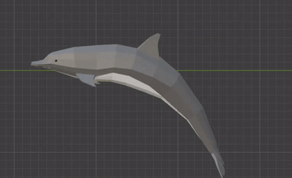

# Modeling

Low-poly animal models built in Blender.

## Progress

### Dog — done (rigged & animated)

| Sit | Walk |
| --- | --- |
|  |  |

### Dolphin — done (rigged & animated)

### Duck — done (no animations yet)

### Shark — done

