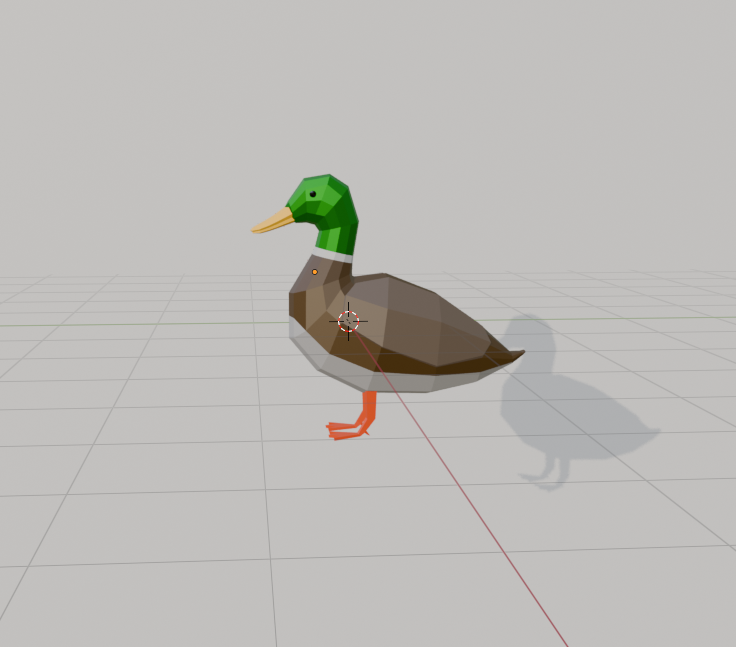
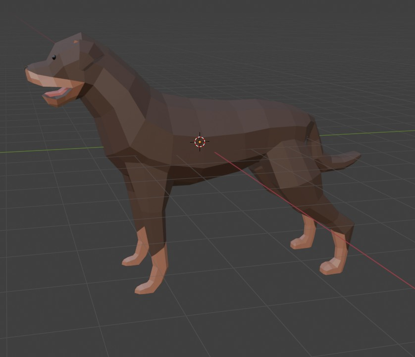
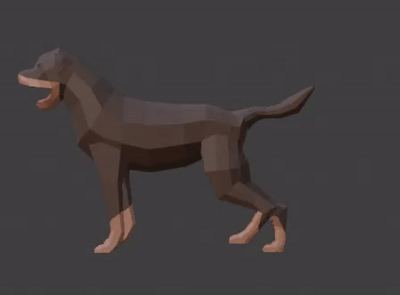
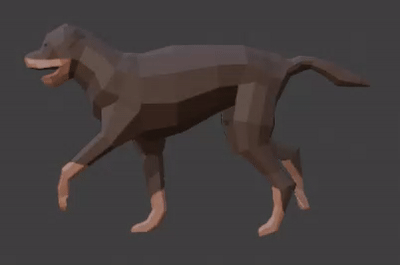
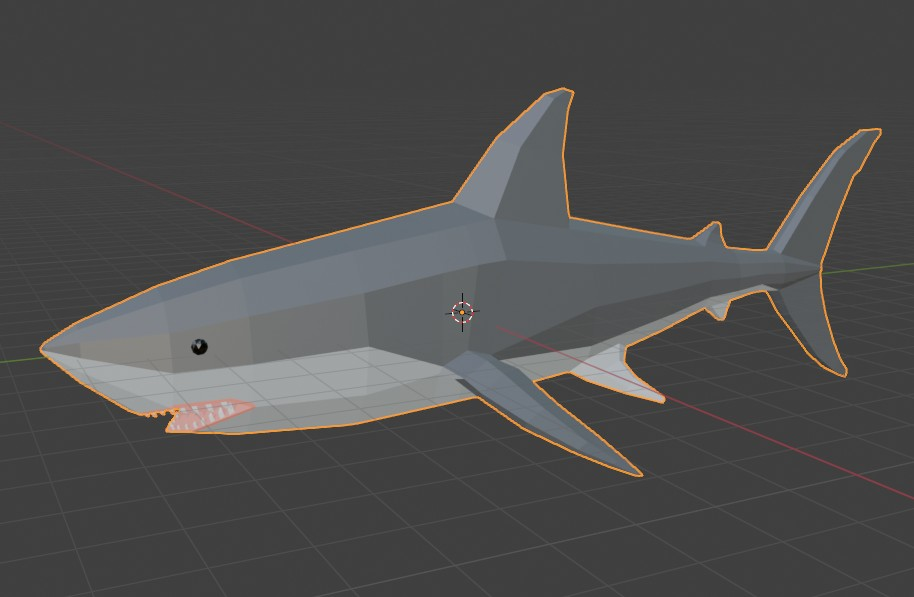

# Modeling

Low-poly animal models built in Blender.

## How to reference images in markdown

Use the standard markdown image syntax with a relative path from the README:

```markdown

```

## Progress

### Dog — done (rigged & animated)



| Sit | Walk |
| --- | --- |
|  |  |

### Duck — done (no animations yet)


### Shark — done


